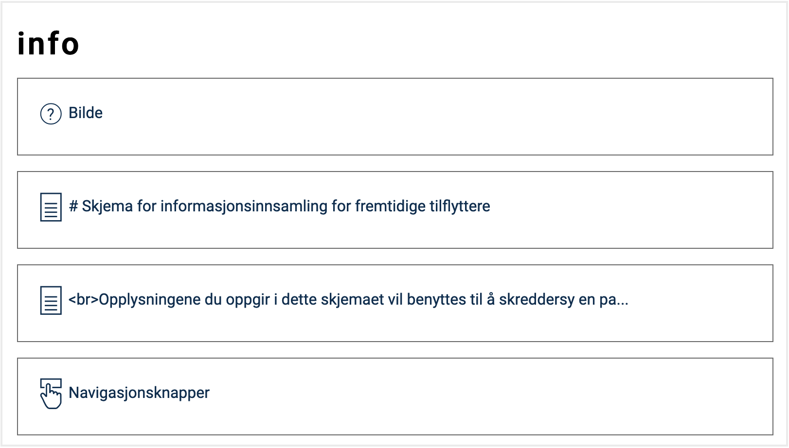
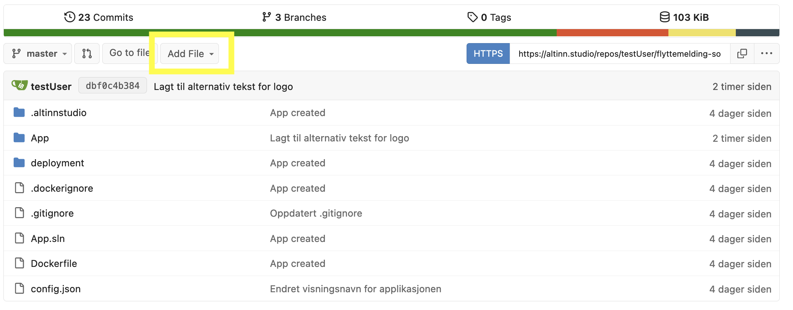
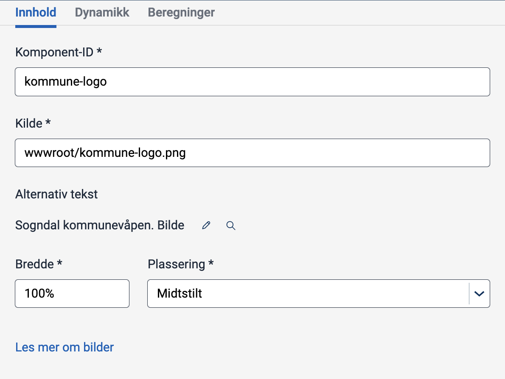
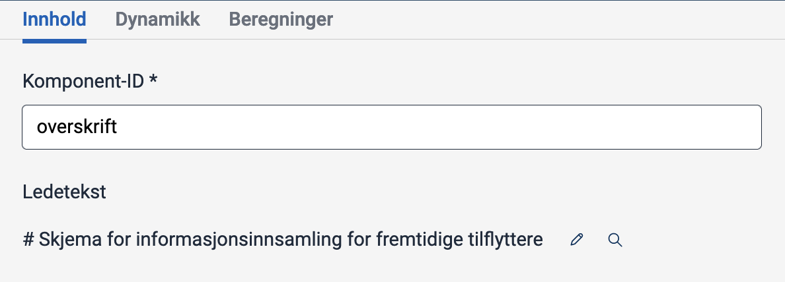
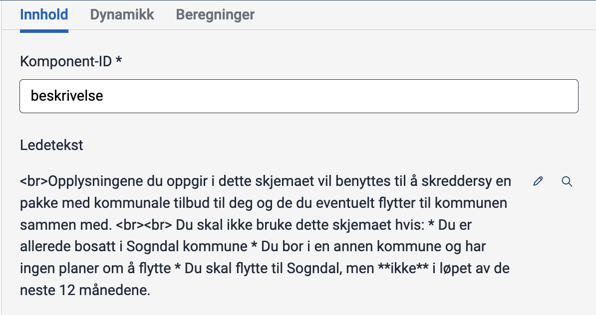
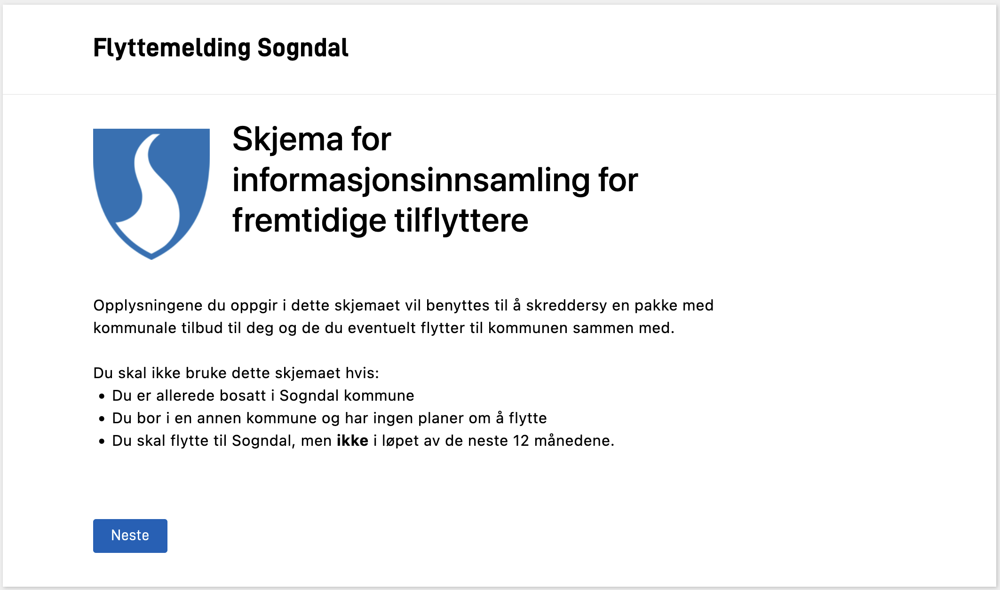
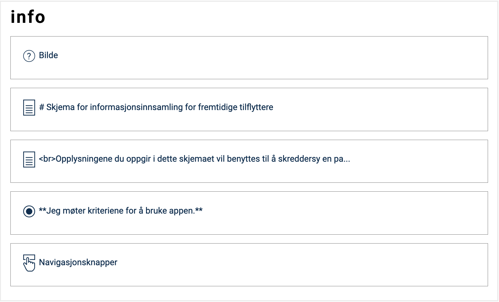
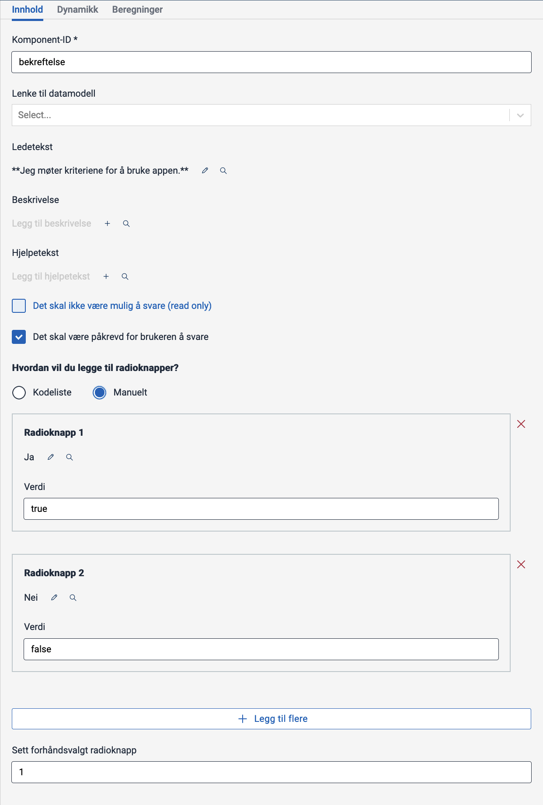
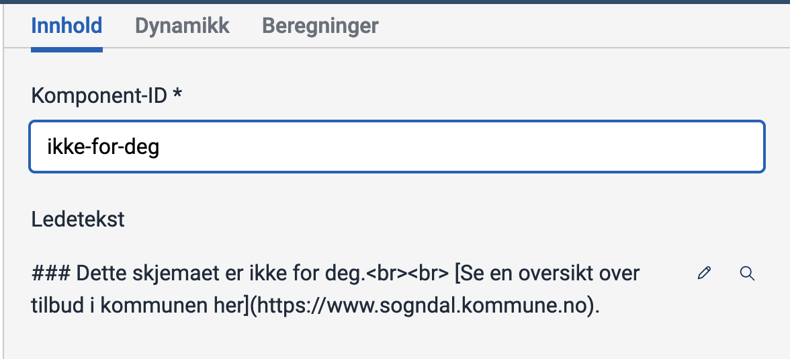

I denne modulen skal du videreutvikle applikasjonen du laget i [modul 1](../modul1) med blant annet en ny side, dynamisk skjuling av sider, sporvalg og forhåndsutfylling.

Deler av modul 2 kan gjøres i [Altinn Studio Designer](/nb/app/getting-started/ui-editor/) (Designer), men noe må utføres med [lokal utvikling](/nb/app/getting-started/local-dev).

**Temaer som dekkes i denne modulen:**

- Flere sider
- Bildekomponent
- Dynamisk skjuling av sider
- Sporvalg
- Forhåndsutfylling

## Oppgaver

{}

For skjemaer der det samles inn eller gis mye informasjon
vil det forbedre brukeropplevelsen dersom man deler applikasjonen opp i flere sider.

La oss se nærmere på hvordan man kan opprette en ny side i applikasjonen
som vises _før_ brukeren kommer til første datainnsamlingsside som ble laget i modul 1.

Opprettelse og administrasjon av flere sider kan enkelt gjøres i [Altinn Studio Designer](/nb/app/getting-started/ui-editor/) (venstre panel).
 For manuelt oppsett av sider, se 'Nyttig dokumentasjon' lenger ned på siden.

Da er det eneste som gjenstår å sette seg inn i kommunens
krav til infosiden og komme i gang med utviklingen. Lykke til!

### Krav fra kommunen

I og med at det skal samles inn en god del data i denne tjenesten,
er det viktig for Sogndal kommune at det tydelig kommuniseres hvem skjemaet
er ment for og hva som vil gjøres med dataen som samles inn.
Noen i kommunen har opprettet en [skisse av informasjonssiden](/app/app-dev-course/modul2/infoside_tilflyttere.pdf).

Følgende er ønskelig at reflekteres i applikasjonen:
 - plassering av bilder
 - tekststørrelser
 - formatering av tekst

Bilde av Sogndals kommunevåpen som kan benyttes i applikasjonen:


### Oppgaver
1. Legg til en ny side. Gi den et passende navn og sørg for at den vises før skjemasiden du opprettet i modul 1.
2. [Legg til bilde](/nb/app/development/ux/components/images/#legge-til-bilder-i-applikasjonen) av Sogndals kommunevåpen.
3. Legg til tekst i henhold til [skisse](/app/app-dev-course/modul2/infoside_tilflyttere.pdf).

### Nyttig dokumentasjon

- [Formatering av tekst i en applikasjon](/nb/app/development/ux/texts/#formatering-av-tekster)
- [Hvordan legge til bilder i en applikasjon](/nb/app/development/ux/components/images/)
- [Sidestilte komponenter](/nb/app/development/ux/styling/#sidestilte-komponenter-grid)
- [Filoppsett ved flere sider](/nb/app/development/ux/pages/#oppsett)
- [Administrere rekkefølge på flere sider](/nb/app/development/ux/pages/navigation/#rekkefølge)

### Forståelsessjekk

{}
<br>

I `App/ui/Settings.json` ligger siderekkefølgen beskrevet.
For å justere på siderekkefølgen, må listen beskrevet under `pages.order` endres til å representere ønsket siderekkefølge.  
Se [Administrere rekkefølge på flere sider](/nb/app/development/ux/pages/navigation/#rekkefølge).
{}

<br>

{}
<br>

- `App/ui/layouts/<page>.json`: endre filnavnet (`<page>`) på siden som skal bytte navn.
- `App/ui/Settings.json`: endre navnet på siden under `pages.order`.
{}

<br>

{}
<br>

Alle tekstressurser støtter markdown og dermed html-notasjon, så ved å benytte `<br>` vil man kunne tvinge tekstbrytning.
{}

{}

{}

I mange tilfeller er det ikke aktuelt å svare på alle spørsmål i et skjema, kanskje fordi svaret sier seg selv, eller fordi det ikke er relevant basert på noe man har svart tidligere i skjemaet. Da kan sporvalg være en god løsning.
 Ved hjelp av sporvalg kan man styre hvilke sider i en applikasjon som er synlige for brukeren.

I denne oppgaven skal du sette opp sporvalg i applikasjonen basert på kravene fra Sogndal kommune.

### Krav fra kommunen

En bruker som ikke oppfyller kravene for skjemaet skal stoppes så tidlig som mulig i arbeidsflyten.
 På infosiden er det ønskelig at brukeren skal oppgi om skjemaet gjelder dem eller ikke.

Hvordan svaret innhentes er valgfritt. Merk at en komponent må knyttes til et felt i datamodellen for å kunne lagre verdier.
  Feltet `Innflytter.KanBrukeSkjema` i datamodellen kan benyttes til dette formålet.

Basert på svaret skal brukeren sendes videre til ett av følgende spor:

*Spor 1*

- Brukeren har ikke svart bekreftende på at skjemaet gjelder deres situasjon

- Bruker skal sendes til en side med følgende tekst:

    > Dette skjemaet er ikke for deg.  
    > [Se en oversikt over andre tilbud i kommunen her](https://www.sogndal.kommune.no/).

- Linje 2 i teksten er en hyperlenke som peker på
https://www.sogndal.kommune.no/

*Spor 2*

- Brukeren har svart bekreftende på at skjemaet gjelder deres situasjon.

- Brukeren sendes videre til datainnsamlingssidene.

### Oppgaver

1. Legg til en komponent hvor brukeren kan oppgi om skjemaet gjelder dem eller ikke.
2. Legg til en side brukeren skal sendes til i _spor 1_.
3. Legg til logikk som aktiverer _spor 1_ eller _spor 2_ basert på brukerens svar.

### Nyttig dokumentasjon
- [Dynamiske uttrykk](/nb/app/development/logic/expressions)
- [Hvordan vise/skjule hele sider](/nb/app/development/logic/expressions/#viseskjule-hele-sider)
- [Formatering av tekst](/nb/app/development/ux/texts/#formatering-av-tekster)

### Forståelsessjekk

{}
<br>

Dersom du har denne typen logikk i en applikasjon der man kan fortsette til innsending for flere spor, bør dataen på siden(e) som nå blir skjult for bruker nullstilles.
{}

{}


{}

En av fordelene til Altinn er at man allerede har metadata om både personer og virksomheter tilgjengelig. Ved hjelp av forhåndsutfylling kan man hente ned data om brukerne og presentere den i utfylte felter, slik at de slipper å fylle dem ut selv. Typiske forhåndsutfyllingsverdier vil være navn, adresse, e-post osv.

Dersom data er tilgjengelig i en av Altinns [forhåndsutfyllingskilder](/nb/app/development/data/prefill/config/#tilgjengelige-prefill-verdier), kan dette konfigureres mot et felt i datamodellen og automatisk populeres når skjemaet opprettes. Dersom man har andre behov for forhåndsutfylling, kan dette løses med kode i applikasjonen.

I denne oppgaven flyttes fokus tilbake til den første datainnsamlingssiden, og målet er å forhåndsutfylle personopplysninger om sluttbrukeren for å spare brukeren for tid.

### Krav fra kommunen

- Følgende verdier skal forhåndsutfylles for brukeren:
  - Fornavn: `Innflytter.Fornavn`
  - Mellomnavn: `Innflytter.Mellomnavn`
  - Etternavn: `Innflytter.Etternavn`
  - E-post: `Innflytter.Kontaktinformasjon.Epost`
  - Telefonnummer: `Innflytter.Kontaktinformasjon.Telefonnummer`
  - Alder: `Innflytter.Alder`

- Det skal **ikke** være mulig å endre forhåndsutfylt navn og alder
- Det skal være mulig å endre forhåndsutfylt e-post og telefonnummer

### Oppgaver
1. Opprett en fil for forhåndsutfylling.
2. Konfigurer forhåndsutfylling for alle verdier unntatt alder i listen over. For felter som ikke skal kunne endres må dette konfigureres.
3. Opprett [egendefinert forhåndsutfylling](/nb/app/development/data/prefill/custom) for alder basert på personnummer. Husk at alder ikke skal kunne endres av bruker.

{}
<br>

Denne funksjonen kan brukes til å beregne alder fra personnummeret.
```cs
private static int CalculateAge(string sosialSecNumber)
{
    int MAX_D_NUMBER = 71;
    int MIN_D_NUMBER = 41;
    int MAX_TEST_NUMBER = 92;
    int MIN_TEST_NUMBER = 81;
    int START_D_NUMBER = 40;
    int START_TEST_NUMBER = 80;
    string stringDay = sosialSecNumber.Substring(0, 2);
    string stringMonth = sosialSecNumber.Substring(2, 2);
    string stringYear = sosialSecNumber.Substring(4, 2);
    string stringIndivid = sosialSecNumber.Substring(6, 3);
    int day = int.Parse(stringDay);
    int month = int.Parse(stringMonth);
    int year = int.Parse(stringYear);
    int individ = int.Parse(stringIndivid);
    // Get day if D-number
    if (MAX_D_NUMBER >= day && MIN_D_NUMBER <= day)
    {
        day -= START_D_NUMBER;
    }
    // Get month if TestUser-number
    if (MAX_TEST_NUMBER >= month && MIN_TEST_NUMBER <= month)
    {
        month -= START_TEST_NUMBER;
    }
    // find century
    if (year > 54 && (individ >= 500 && individ < 750))
    {
        // 1855-1899
        year += 1800;
    }
    else if (year > 39 && (individ >= 900 && individ < 1000))
    {
        // 1940-1999
        year += 1900;
    }
    else if (year < 40 && (individ >= 500 && individ < 1000))
    {
        // 2000-2039
        year += 2000;
    }
    else
    {
        year += 1900;
    }
    // calculate age
    int age = DateTime.Now.Year - year;
    if (DateTime.Now.Month < month)
    {
        age -= 1;
    }
    else if (DateTime.Now.Month == month)
    {
        if (DateTime.Now.Day < day)
        {
            age -= 1;
        }
    }
    return age;
}
```
{}
<br>

*Husk å pushe de lokale endringene dine så de blir tilgjengelige i Altinn Studio.*

### Nyttig dokumentasjon
- [Tilgjengelige kilder og verdier for forhåndsutfylling](/nb/app/development/data/prefill/config/#tilgjengelige-prefill-verdier)
- [Forhåndsutfylling fra nasjonale registre og brukerprofil](/nb/app/development/data/prefill/config/#prefill-fra-nasjonale-register-og-brukerprofil)
- [Egendefinert forhåndsutfylling](/nb/app/development/data/prefill/custom)
- [Beskrivelse av InstanceOwner-objektet](/nb/api/models/instance/#instanceowner) - Her finner man personnummeret.
  Vær oppmerksom på at egenskapene refereres til med store forbokstaver i koden, ikke med små som i denne oversikten.


### Forståelsessjekk

{}
<br>

Ja. Dersom man ikke gjør noen endringer vil en standardkomponent med forhåndsutfylt data være redigerbar.
{}

<br>

{}
<br>

Komponenten kan settes til `readOnly` på én av to måter:

1\. I Altinn Studio Designer ved å huke av ved "Det skal ikke være mulig å svare (read only)" for den aktuelle komponenten:


2\. Sette egenskapen `readOnly` til `true` for komponenten i json-filen til siden:
```json{linenos=false,hl_lines=["13"]}
// Fil: /App/ui/layouts/<page>.json
{
  "$schema": "https://altinncdn.no/schemas/json/layout/layout.schema.v1.json",
  "data": {
    "layout": [
      {
        "id": "firstName",
        "type": "Input",
        "dataModelBindings": {
          "simpleBinding": "Innflytter.Fornavn"
        },
        "required": false,
        "readOnly": true,
        "textResourceBindings": {
          "title": "firstName"
        }
      }
    ]
  }
}
```

Alternativt kan man kjøre valideringer av dataen på serversiden for å verifisere at dataen i feltet matcher dataen fra forhåndsutfyllingskilden. Dette kan gjøres i prosesserings- eller valideringslogikken til applikasjonen.
{}

<br>

{}
<br>

{}
Et [D-nummer](https://jusleksikon.no/wiki/F%C3%B8dselsnummer#D-nummer) er ellevesifret, som ordinære fødselsnummer, og består av en modifisert sekssifret fødselsdato og et femsifret personnummer. Fødselsdatoen modifiseres ved at _det legges til 4 på det første sifferet_: En person født 1. januar 1980 får dermed fødselsdato 410180, mens en som er født 31. januar 1980 får 710180.
{}

Én måte å gå fra et vilkårlig fødsels- eller d-nummer til en streng for fødselsdato på formatet `dd-MM-yy` på er:

```cs
public static string GetDOB(string fOrDNumber){
  List<string> firstCharsInDNumber = new(){"4", "5", "6", "7" };

  var fOrDNumberArray = fOrDNumber.ToCharArray();

  char[] dobArray = new char[6];
  Array.Copy(fOrDNumberArray, dobArray, 6);

  char firstChar = dobArray[0];
  int firstInt = 0;

  if(firstCharsInDNumber.Contains(firstChar.ToString()))
  {
    firstInt = firstChar - 4;
    dobArray[0] = (char)firstInt;
  }

  string dobString = $"{dobArray[0]}{dobArray[1]}.{dobArray[2]}{dobArray[3]}.{dobArray[4]}{dobArray[5]}";
  // verify that it is a valid date
  DateTime.ParseExact(dobString, "dd.MM.yy", CultureInfo.InvariantCulture);
  return dobString;
}
```
{}

{}

## Oppsummering
I denne modulen har du utvidet applikasjonen din med mer funksjonalitet i form av å
legge til flere sider, sette opp sporvalg for å styre brukerflyten og sette opp forhåndsutfylling av skjemafelter
både med tilgjengelige datakilder i Altinn og egendefinert kode.

Tjenesten skal kunne kjøres opp på din lokale maskin med lokal test og du skal kunne teste begge brukerflytene og
bekrefte at riktige felter blir forhåndsutfylt.

<br>



{}
[Kildekode modul 2](https://altinn.studio/repos/testdep/flyttemelding-sogndal/src/branch/modul2)<br>
[(Kildekode tidligere versjon modul 2)](https://altinn.studio/repos/ttd/tilflytter-sogndal-lf/src/branch/bolk/2)<br>
{}

<h3>Legge til infoside</h3>




<br>

#### Infoside oppsett

Bildet det refereres til er lastet ned og lagret i mappen`/App/wwwroot` i appen (mappen `wwwroot` ble også opprettet).
 Et alternativ er å bruke en ekstern URL for bildet som kilde.

Sidestilling av bilde og overskrift er gjort ved hjelp av `grid` (se markeringer).

```json{linenos=false,hl_lines=["17-19", "30-32"]}
// File: /App/ui/layouts/info.json

{
  "$schema": "https://altinncdn.no/schemas/json/layout/layout.schema.v1.json",
  "data": {
    "layout": [
      {
        "id": "kommune-logo",
        "type": "Image",
        "image": {
          "src": {
            "nb": "wwwroot/kommune-logo.png"
          },
          "width": "100%",
          "align": "center"
        },
        "grid": {
          "xs": 2
        },
        "textResourceBindings": {
          "altTextImg": "kommune-logo.altTextImg"
        }
      },
      {
        "id": "overskrift",
        "type": "Paragraph",
        "textResourceBindings": {
          "title": "info.overskrift.title"
        },
        "grid": {
          "xs": 7
        }
      },
      {
        "id": "beskrivelse",
        "type": "Paragraph",
        "textResourceBindings": {
          "title": "info.beskrivelse.title"
        }
      },
      {
        "id": "NavigationButtons-hateTR",
        "type": "NavigationButtons",
        "componentType": "NavigationButtons",
        "dataModelBindings": {},
        "showBackButton": true,
        "textResourceBindings": {
          "next": "navigation.next",
          "back": "navigation.back"
        }
      }
    ]
  }
}
```

#### Tekstressurser (nb)
```json
// File: /App/config/texts/resource.nb.json

{
  "language": "nb",
  "resources": [
    ...
    {
      "id": "info.overskrift.title",
      "value": "# Skjema for informasjonsinnsamling for fremtidige tilflyttere"
    },
    {
      "id": "info.beskrivelse.title",
      "value": "<br>Opplysningene du oppgir i dette skjemaet vil benyttes til å skreddersy en pakke med kommunale tilbud til deg og de du eventuelt flytter til kommunen sammen med.\n<br><br>\nDu skal ikke bruke dette skjemaet hvis:\n* Du er allerede bosatt i Sogndal kommune\n* Du bor i en annen kommune og har ingen planer om å flytte\n* Du skal flytte til Sogndal, men **ikke** i løpet av de neste 12 månedene."
    },
    {
      "id": "kommune-logo.altTextImg",
      "value": "Sogndal kommunevåpen. Bilde"
    }
  ]
}
```



<br>

#### Komponenter

{}
Se *Kode* for sidestilling av komponenter.
{}



#### Bilde

Bildet det refereres til er lastet ned og lagret i mappen`/App/wwwroot` i appen (mappen `wwwroot` ble også opprettet).
 Et alternativ er å bruke en ekstern URL for bildet som kilde.

{}
<br>

Naviger til repository (klikk logo øverst i høyre hjørne eller tre prikker til høyre på menylinjen) og velg "Last opp fil" fra menyen "Add file".



I feltet "Legg til mappe" fyller du inn `/App/wwwroot`.
 Last opp bildet og legg til en beskrivende commit-melding.
  Klikk "Commit endringer" for å lagre.


{}




#### Overskrift

Overskriften er lagt til som "Tekst" > "Paragraf" og formatert med markdown.



#### Beskrivelse

Beskrivelsen er lagt til som "Tekst" > "Paragraf" og formatert med markdown.












{}

<h3>Alternativ arbeidsflyt</h3>



<br>

#### Radioknapper

Det er lagt til en komponent for radioknapper som er koblet til feltet `Innflytter.KanBrukeSkjema` i datamodellen.
 Merk at verdiene for `options` må korrespondere med tillatte verdier for dette feltet.

(Deler av koden er utelatt.)
```json{linenos=false,hl_lines=["8-29"]}
// File: /App/ui/layouts/info.json

{
  "$schema": "https://altinncdn.no/schemas/json/layout/layout.schema.v1.json",
  "data": {
    "layout": [
      ...
      {
        "id": "bekreftelse",
        "type": "RadioButtons",
        "required": true,
        "textResourceBindings": {
          "title": "info.bekreft"
        },
        "dataModelBindings": {
          "simpleBinding": "Innflytter.KanBrukeSkjema"
        },
        "options": [
          {
            "label": "info.ja",
            "value": "true"
          },
          {
            "label": "info.nei",
            "value": "false"
          }
        ],
        "preselectedOptionIndex": 1
      },
      ...
    ]
  }
}
```

#### Ny side 'Ikke for deg' og logikk ved veivalg

Det er lagt til en ny side som skal vises dersom brukeren ikke oppfyller kravene for å bruke tjenesten.
Logikk for å skjule siden er lagt til ved hjelp av egenskapen `hidden` (se markering i koden).
 Når det krysses av for at man oppfyller kravene for å bruke tjenesten.Siden blir skjult når verdien til komponenten med id `bekreftelse` (som er radioknapper) er lik `true`, altså 

```json{linenos=false,hl_lines="6-13"}
// File: /App/ui/layouts/ikke-for-deg.json

{
  "$schema": "https://altinncdn.no/schemas/json/layout/layout.schema.v1.json",
  "data": {
    "hidden": [
      "equals",
      [
        "component",
        "bekreftelse"
      ],
      true
    ],
    "layout": [
      {
        "id": "ikke-for-deg",
        "type": "Paragraph",
        "textResourceBindings": {
          "title": "ikke-for-deg.info"
        }
      },
      {
        "id": "NavigationButtons-azt7sj",
        "type": "NavigationButtons",
        "componentType": "NavigationButtons",
        "dataModelBindings": {},
        "showBackButton": true,
        "textResourceBindings": {
          "back": "navigation.back"
        }
      }
    ]
  }
}
```

Tilsvarende logikk er lagt til for skjemasiden.
 Denne siden vil skjules dersom verdien til `bekreftelse`-komponenten er satt til `false`, altså når det krysses av for at man *ikke* oppfyller kravene for tjenesten.

```json{linenos=false,hl_lines=["6-13"]}
// File: /App/ui/layouts/innflytterPersonalia.json

{
  "$schema": "https://altinncdn.no/schemas/json/layout/layout.schema.v1.json",
  "data": {
    "hidden": [
      "equals",
      [
        "component",
        "bekreftelse"
      ],
      false
    ],
    "layout": [
      ...
```

#### Ekskludere side fra pdf

Siden 'Ikke for deg' ønsker vi ikke å inkludere dersom det skal genereres en pdf-fil.
 Dette kan stilles inn med egenskapen `excludeFromPdf` i `Settings.json`.

```json{linenos=false,hl_lines="10"}
// File: /App/Settings.json

{
  "$schema": "https://altinncdn.no/schemas/json/layout/layoutSettings.schema.v1.json",
  "pages": {
    "order": [
      "info",
      "innflytterPersonalia",
      "ikke-for-deg"
    ],
    "excludeFromPdf": ["ikke-for-deg"]
  }
}
```

#### Tekstressurser (nb)

Nye tekstressurser som er lagt til.

(Deler av koden er utelatt.)
```json{linenos=false,hl_lines=["7-22"]}
// File: /App/config/texts/resource.nb.json

{
  "language": "nb",
  "resources": [
    ...
    {
      "id": "info.bekreft",
      "value": "**Jeg møter kriteriene for å bruke appen.**"
    },
    {
      "id": "info.ja",
      "value": "Ja"
    },
    {
      "id": "info.nei",
      "value": "Nei"
    },
    {
      "id": "ikke-for-deg.info",
      "value": "### Dette skjemaet er ikke for deg.<br><br>\n[Se en oversikt over tilbud i kommunen her](https://www.sogndal.kommune.no)."
    }
  ]
}
```




<br>

{}
Se *Kode* for logikk ved veivalg.
{}

#### Radioknapper info-side

Det er lagt til en komponent for radioknapper på info-siden hvor brukeren skal angi om de oppfyller kravene for å bruke skjemaet.
 Alternativt kan man bruke en avkrysningsboks eller nedrekksfelt.







#### Ikke-for-deg-side

Ny side for *Spor 1*.











{}

<h3>Forhåndsutfylling</h3>














<br><br>

[<< Forrige modul](../modul1/) | [Neste modul >>](../modul3/)